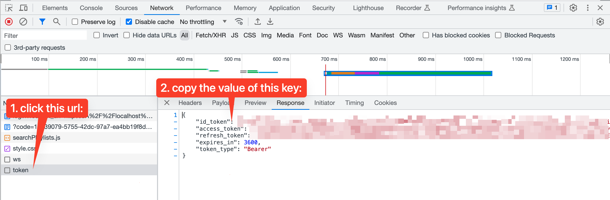

# Overview
This document outlines several tips for working with various parts of this codebase.

## General

- We noted this in [README-SETUP.md](./README-SETUP.md), but wanted to emphasize it again. **You should do all of your development on branches named like `feature/NAME-OF-FEATURE` regardless of what type scenario you are using to deploy/test the software.** Even if you are developing/testing locally, you will end up wanting to deploy it to AWS and the GitHub Actions will only execute on branches that start with `feature`.
- If you make changes to the frontend code (e.g. Javascript/HTML/CSS code) you do not need to restart the `npm` server - it will automatically detect them. If you change anything in the _configuration_ of the frontend code (e.g. `webpack.config.js` or `package.json`) you will need to stop/restart it.
- When running the backend code locally, if you make changes to your Java code you'll need to rerun `sam build` to "deploy" those changes to the local Docker containers. Depending on your computer, you might be able to run `sam build` in a different terminal tab while the local API is running, however it's also possible that this won't work and you'll need to stop the local API, rerun `sam build`, and then rerun `sam local start-api`.
- The way we launch the local API should look familiar to what we've done previously. However, we've added an important argument here: `--warm-containers LAZY`. When you are interacting with your service from a web application you want it to respond as quickly as possible. By adding this argument we tell SAM to keep the Docker containers "warm", that is - don't terminate them after each request. The argument `LAZY` tells it to wait for a request to come in before launching the Docker container. The first time you use each endpoint in the service it will take a few seconds to launch and respond. Successive times that you use the endpoint will be much faster. If you don't include this argument each request will take longer than you want it to.

| Files that changed                   |Commands to run|
|--------------------------------------|--------------|
| *.java                               |`sam build` and `sam local start-api --warm-containers LAZY`|
| web/static_assets/\* (*.html, *.css) |n/a|
| web/src/\*/\*.js                     |n/a|
| package.json                         |`npm install` and `npm run run-local`|
| webpack.config.json                  |`npm run run-local`|  
| template.yaml                        |`sam build` and `sam local start-api --warm-containers LAZY`|

## Remote Debugging
Since we're using the `--warm-containers LAZY` argument as noted above, you'll need to add an additional argument to your `sam local` commands if you're wanting to do remote debugging. In addition to the `--debug-port` argument we've used previously, you need to add `--debug-function` to specify which Lambda function you are intending to debug. To debug the `GetPlayistLambda` on port `5005` you'd run the following:

```shell
sam local start-api --warm-containers LAZY --debug-port 5005 --debug-function GetPlaylistLambda
```

You'll continue with the same order of operations in order to connect your debugger (e.g. run the above command, trigger an API request, then start the remote debugger in IntelliJ).

## Working With Cognito Tokens
You can continue to run `curl` commands against your local SAM API, and while this will work without authentication if you use the `sam local...` command, there are many circumstances where you'll actually _want_ access to that Cognito data within the reque3st. To do that, you need to pass an authentication token with your `curl` request. This is how you get and pass that token.

### Getting The Token
This is handled for us by the AWS Amplify framework the front-end Javascript. In order to get the token that's generated:

- Open your web browser dev tools and open the Network tab.
- Login to the application normally (i.e. clicking the "Login" button and logging into Cognito)
- In the Network tab you'll see a URL called `token`. Click on that URL and look at the "preview" or "response" tab. You should see several fields that end in `_token`. You'll want to copy the one called `id_token` and save that for your `curl` command (next step).


_Figure 1. Diagram of browser network tools showing the `token` URL and `id_token` value that you need._

### Using The Token
We'll pass the token as a request header (e.g. a `-H` flag to `curl`). It'll look something like this:

```shell
curl -X POST http://localhost:3000/some_endpoint \
	-H 'Authorization: Bearer <id_token_from_above>' \
	-d '{"some": "data", "if": "necessary"}'
```

> **NOTE:** The trailng slashes (`\`) at the end of each line are to allow you to copy/paste the command into your terminal. If you end up running a command like this all on one line you should not include the slashes.

Your `AuthenticatedLambdaRequest` object will then be able to get the user info from that token so that you can use it in your code.

Note that this is similar to what's done in [Javascript code](web/src/api/musicPlaylistClient.js) using the Axios library.