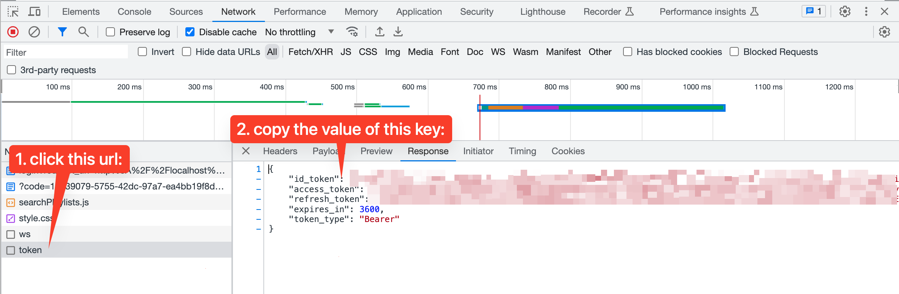

# Overview
This document outlines several tips for working with various parts of this codebase.

## Working With Cognito Tokens
You can continue to run `curl` commands against your local SAM API, and while this will work without authentication if you use the `sam local...` command, there are many circumstances where you'll actually _want_ access to that Cognito data within the reque3st. To do that, you need to pass an authentication token with your `curl` request. This is how you get and pass that token.

### Getting The Token
This is handled for us by the AWS Amplify framework the front-end Javascript. In order to get the token that's generated:

- Open your web browser dev tools and open the Network tab.
- Login to the application normally (i.e. clicking the "Login" button and logging into Cognito)
- In the Network tab you'll see a URL called `token`. Click on that URL and look at the "preview" or "response" tab. You should see several fields that end in `_token`. You'll want to copy the one called `id_token` and save that for your `curl` command (next step).


_Figure 1. Diagram of browser network tools showing the `token` URL and `id_token` value that you need._

### Using The Token
We'll pass the token as a request header (e.g. a `-H` flag to `curl`). It'll look something like this:

```shell
curl -X POST http://localhost:3000/some_endpoint \
	-H 'Authorization: Bearer <id_token_from_above>' \
	-d '{"some": "data", "if": "necessary"}'
```

> **NOTE:** The trailng slashes (`\`) at the end of each line are to allow you to copy/paste the command into your terminal. If you end up running a command like this all on one line you should not include the slashes.

Your `AuthenticatedLambdaRequest` object will then be able to get the user info from that token so that you can use it in your code.

Note that this is similar to what's done in [Javascript code](web/src/api/musicPlaylistClient.js) using the Axios library.